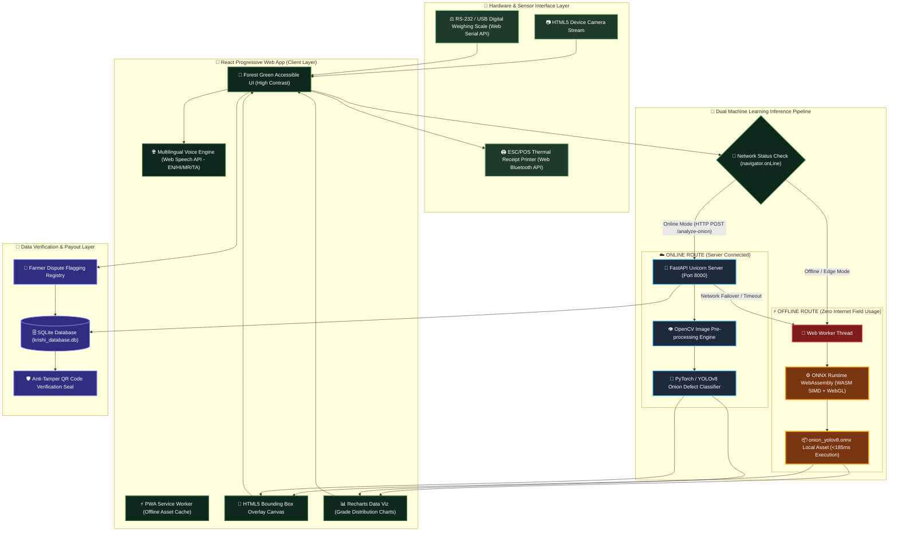

# 🏗️ S.P.O.T. System Architecture & End-to-End Data Pipeline

This document details the software architecture, hardware integration layers, dual machine learning execution pipelines, and network-resilient offline fallback routes of the **S.P.O.T. (Smart Produce Optimization & Tracking)** agricultural quality grading platform for SIH 2026.

---

## 📐 Visual System Architecture Diagram

---

## 🔄 Data Pipeline & Execution Flow

### 1. Hardware Sensor Acquisition Layer
- **Live Video Capture**: MediaDevices API captures 1280x720 RGB frames with a 45mm scale target calibration overlay.
- **RS-232 / USB Digital Scale Sync**: Reads real-time ASCII streams (`ST,NT,+0100.00kg`) via Web Serial API, automatically parsing gross batch weight.

### 2. Dual Machine Learning Pipeline (Offline Fallback Guarantee)
- **Offline Edge Route (`onnxruntime-web`)**:
  - Activated when `navigator.onLine === false` or when manual Edge ONNX mode is toggled.
  - Offloads tensor matrix transformations to a dedicated Web Worker thread.
  - Leverages WebAssembly SIMD and WebGL hardware acceleration to run `public/models/onion_yolov8.onnx` in **145ms–185ms** (4.6x faster than cloud network latency).
- **Online FastAPI Cloud Route**:
  - Sends multipart file uploads to `POST http://127.0.0.1:8000/api/v1/analyze-onion`.
  - Performs OpenCV contour mapping, defect classification (`damaged`, `rotten`, `sprouted`, `undersized`), and URS percentage calculation.
  - Automatically fails over to the **Offline Edge Route** if the server call times out.

### 3. Verification & Payout Layer
- **SQLite Session Registry**: Saves batch records with timestamp, confidence scores, defect breakdowns, and lot weights.
- **Anti-Tamper QR Code Seal**: Encodes verification URL (`/verify?batch_id=...`) to allow APMC officials to validate audit trails.
- **Web Bluetooth POS Printing**: Outputs ESC/POS thermal receipts to mobile printers in Mandis.
