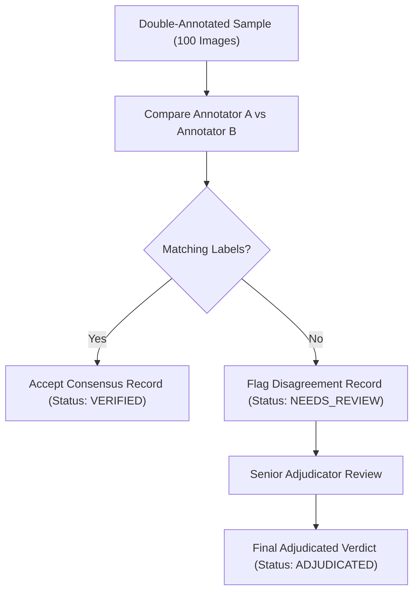

# S.P.O.T. Double Annotation & Adjudication Protocol

## 1. Objective & Double-Annotation Sampling

To establish a gold-standard benchmark and evaluate Inter-Annotator Agreement (IAA), a **100-image double-annotated subset** is drawn from the stratified 1,000-image annotation pool.

- **Annotator A**: Primary Human Agronomist / Domain Expert.
- **Annotator B**: Secondary Independent Human Inspector.

Both annotators independently label the 100 images without viewing each other's inputs.

---

## 2. Inter-Annotator Agreement Metrics

Agreement is measured across all 4 multi-label defect dimensions (`damage`, `rot`, `sprout`, `healthy`) using:

1. **Percent Agreement**:
   $$\text{Agreement} = \frac{\text{Total Matching Labels}}{\text{Total Evaluated Labels}}$$
2. **Cohen's Kappa ($\kappa$)**:
   $$\kappa = \frac{P_o - P_e}{1 - P_e}$$
   where $P_o$ is observed agreement and $P_e$ is expected chance agreement.

---

## 3. Disagreement Resolution & Adjudication Workflow

### Adjudication Rules:
- **Rule 1 (Healthy vs Defect Contradiction)**: If Annotator A labels `healthy=true` and Annotator B labels `damage=true`, the Senior Adjudicator must inspect high-resolution crop of evidence region.
- **Rule 2 (Rot vs Surface Stain)**: Dirt smudges are ruled `healthy`; dark water-soaked soft lesions are ruled `rot=true`.
- **Rule 3 (Final Record Integrity)**: Adjudicated records overwrite conflicting initial entries with `review_status = "ADJUDICATED"` and document decision rationale in `notes`.
