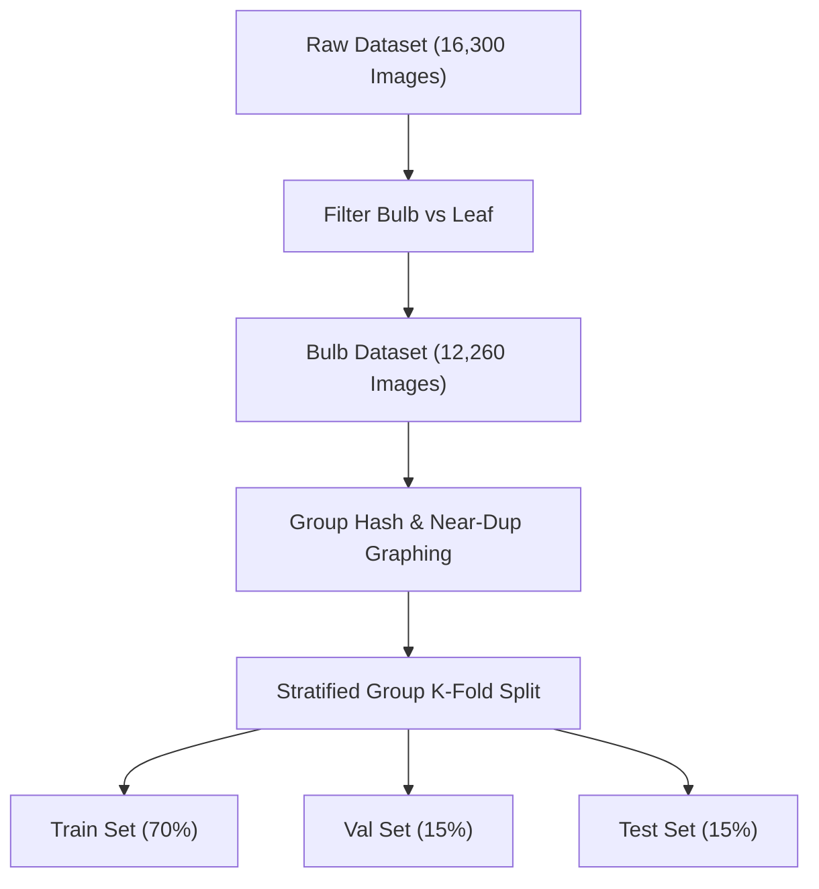

# S.P.O.T. Dataset Split Recommendation & Leakage Risk Analysis

## 1. Identified Leakage Risks

During the forensic audit of the 16,300 images, three critical data leakage risks were identified:

1. **Exact Cryptographic Duplicates**:
   - Discovered 28 exact SHA-256 duplicate hash groups comprising 57 total files (29 redundant files).
   - If split randomly, identical images will leak across Train, Validation, and Test sets, artificially inflating validation accuracy.

2. **Near-Duplicate Perceptual Clones**:
   - Discovered 276 near-duplicate image pairs with dhash Hamming distance $\le 3$.
   - These are near-identical frames captured seconds apart or slight camera shifts of the exact same bulb/leaf setup.

3. **Sequential Capture / Video Frame Series**:
   - Filenames in directories follow sequential naming (`Onion00001.jpg`, `Onion00002.jpg`, ..., `Onion03000.jpg`).
   - This indicates video frame extraction or continuous burst shooting of the same physical specimens.
   - Standard uniform random splitting will place frames of the same physical onion in both training and test sets.

---

## 2. Recommended Grouping & Splitting Strategy

To ensure zero data leakage and rigorous generalizability evaluation for S.P.O.T. model training in subsequent phases:

### Mandatory Rules for Dataset Partitioning:
1. **Group-Based Partitioning**:
   - Group contiguous sequential blocks (e.g. windows of 10-20 consecutive frames) or cluster connected duplicate/near-duplicate graphs.
   - All images in a near-duplicate cluster or sequential capture burst **MUST** belong strictly to the same partition (Train, Validation, or Test).

2. **Stratified Group Split Ratio**:
   - **Train**: 70% (~11,410 images overall / ~8,582 bulb images)
   - **Validation**: 15% (~2,445 images overall / ~1,839 bulb images)
   - **Test**: 15% (~2,445 images overall / ~1,839 bulb images)

3. **Separate Out-of-Scope Leaf Data**:
   - Leaf foliage images (4,040 images) must be kept in a distinct evaluation subset or filtered prior to bulb quality training.

---

## 3. Implementation Plan for Phase 10 (When Triggered)

