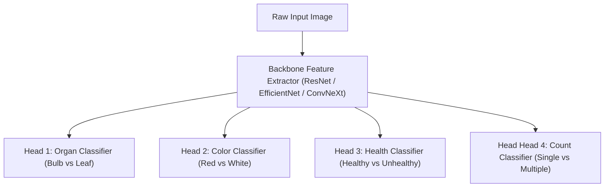

# S.P.O.T. Model & Computer Vision Task Recommendation

## 1. Ground-Truth Driven Recommendation

Based **strictly** on the empirical forensic audit of the real dataset:

### Recommended Primary Computer Vision Task:
**CLASSIFICATION (or Multi-Head / Hierarchical Image Classification)**

---

## 2. Rationale & Evidence

1. **Absence of Object Coordinates**:
   - The source dataset contains **zero** bounding box files (`.txt`, `.xml`) and **zero** segmentation mask annotations.
   - Bounding-box object detection architectures (e.g. YOLO, Faster R-CNN) **cannot** be trained directly on this dataset without manual auto-annotation / bounding-box pseudo-labeling in a subsequent phase.

2. **Folder-Encoded Hierarchy**:
   - Ground-truth labels are image-level classification attributes:
     - **Organ**: Leaf vs Bulb
     - **Color**: Red vs White
     - **Health**: Healthy vs Unhealthy
     - **Quantity**: Single vs Multiple

3. **Multi-Task / Multi-Head Classification Architecture**:
   - Since each image contains multiple independent categorical targets (Color, Health, Single/Multiple), a multi-head CNN or Vision Transformer (ViT) classification architecture is ideal.

---

## 3. Recommended Future Pipeline (Phase 10+)

---

## 4. Preprocessing Requirements for Phase 10 (When Triggered)

1. **Filtering**: Exclude `OUT_OF_SCOPE_FOR_BULB_GRADING` (Leaf folders) when training post-harvest bulb quality models.
2. **Resizing**: Resize images from $1024 \times 768$ / $576 \times 768$ to standard backbone inputs ($224 \times 224$, $384 \times 384$, or $512 \times 512$) preserving aspect ratio with zero-padding.
3. **Data Augmentation**: Apply color jittering, rotation, and horizontal flips during training to mitigate lighting variations.
4. **Group-Based Validation Split**: Strictly enforce sequential group splitting to eliminate data leakage.
